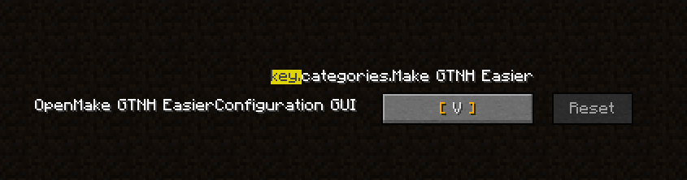
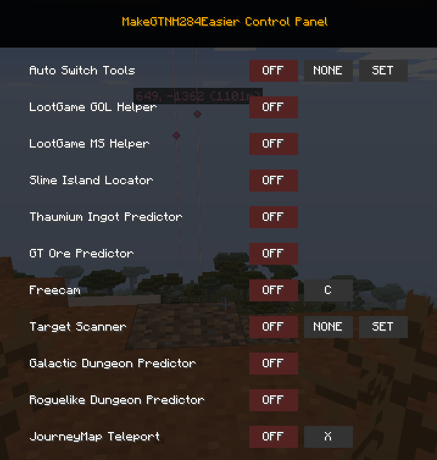
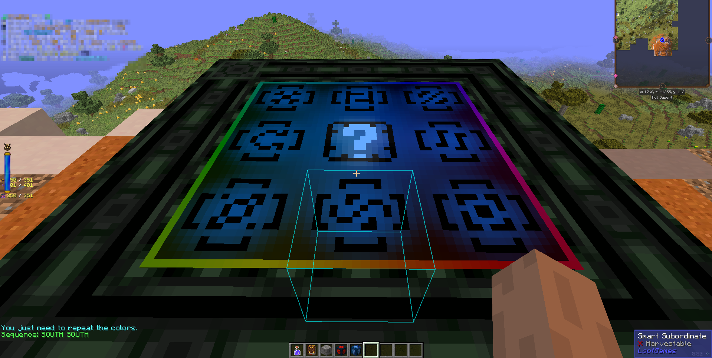
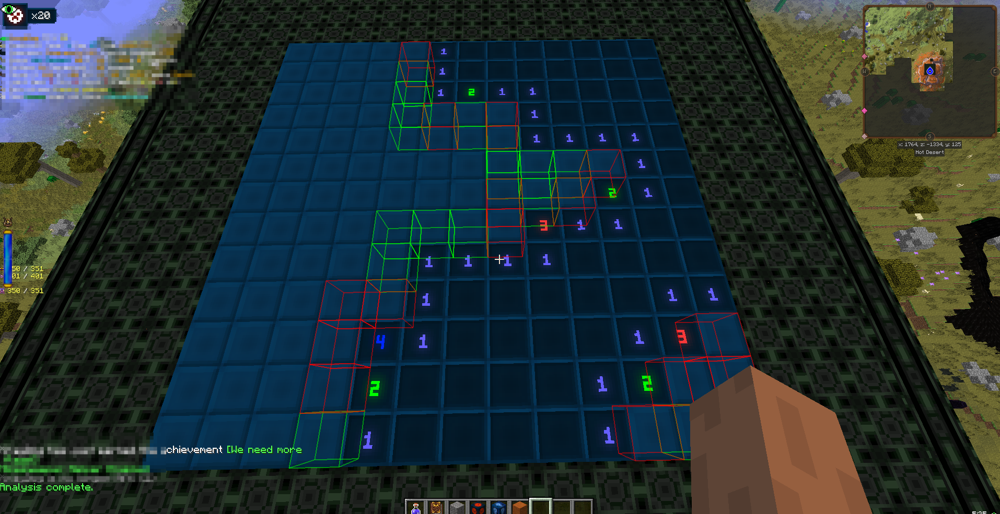
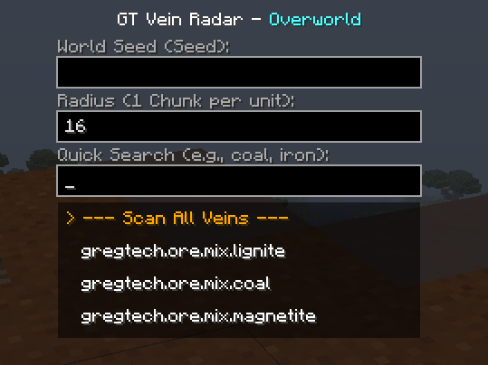

Make GTNH Easier

### 开始使用

默认按 V 键打开配置界面，你可以在游戏控制设置中修改该按键。

🧮控制面板

左侧显示功能名称，右侧为功能控制按钮。

左侧红色的OFF按钮用于开启或关闭对应功能。

中间的 None 选项可绑定快捷键（按下 ESC 可清除绑定）。

右侧的 Set 按钮用于对部分功能进行详细设置。

🛠️ 功能介绍

1. 自动切换工具

该功能配有三个按钮：左侧按钮控制功能开关，中间可绑定快捷键快速启闭，Set 按钮用于切换工作模式。

包含两种工作模式：

持续模式(默认)：挖掘方块时，模组每刻自动检测快捷物品栏，计算最优工具并自动切换

点击模式：仅在按下左键挖掘的瞬间执行一次工具切换逻辑

附加功能

1.匠魂斧头挖掘草方块会损耗耐久且无经验，模组内置黑名单，可避免收割草方块时自动切换斧头

2.若模组检测到攻击生物，会自动关闭工具切换并播放提示音，防止战斗中工具意外切换（下落的沙砾也属于实体）

2. LootGame的点灯小游戏辅助

游玩点灯游戏前需开启该功能，模组可读取解密序列并标记目标，你只需按照提示依次点击即可。

3. LootGame的扫雷小游戏辅助

游玩时可开启该功能，每隔数秒会自动排查地雷与安全格子

红色格子为地雷，绿色格子为安全区域

存在多种可行解时，黄色格子为最安全的选择

该结果通过计算得出，并非直接获取游戏真实答案

4. 史莱姆岛定位 / 星系地牢预测 / 冒险地牢预测

开启这些功能后会进入子页面，操作逻辑一致：手动输入地图种子，即可获取结构坐标。

结构入口不一定在计算点位上，但会在附近，多找找。

同时地形可能导致结构生成残缺或无法生存，该功能无法预判此类情况。

星系地牢只测试过月球和火星,如果其他星球的生成逻辑与月球和火星一致，那么这个功能应该也能找到

5. 神秘锭预测

输入左上角显示的游戏天数，即可获知使用研究笔记获取神秘锭研究笔记的时机。

可通过特定方式跳过砖制高炉，该功能正是为此设计。

禁止使用 /time set day 等指令，会重置左上角天数计数，导致输入错误天数。

6. GT矿脉预测

输入地图种子（该功能会缓存输入的种子，退出存档后清除缓存，减少重复输入）。

设置搜索半径，选择目标矿脉，即可获取矿脉位置。

第三栏为搜索栏，而非选择栏，选中的矿脉会标为黄色，也可选择---扫描所有矿脉---展示范围内全部矿脉类型。

注意事项：

1.仅支持主世界与下界

2.GT矿脉会因地形尝试多次生成，该功能仅模拟首次生成结果，并非100%准确，实在无法找到矿脉时再使用

3.后期可使用探矿仪，该功能仅适用于前期

云母、锰、石英往往极难寻觅:(

末地的预测准确率极低，推测与地形相关，因此关闭了末地的使用权限，避免误导玩家，或许末地拥有独立的矿物生成逻辑？

7. 自由视角

想必大家熟悉，无需过多说明，可绑定快捷键使用。

注意事项：

1.仅屏蔽鼠标移动与角色移动输入，不会屏蔽视角转动、其他模组交互等操作

2.单人模式无限制，多人模式受权限管控，查看指令与服务器规则

8. 目标扫描器

采用独立线程扫描，为世界中的目标方块绘制3D高亮边框。

格雷科技矿物适配：
支持检测格雷科技矿物，但无法识别六面完全被遮挡的矿物。这是格雷科技的设定，作者有意为之，后续不会修复该问题。
开发此功能仅为方便玩家寻找稀有矿脉，因此制作了GT矿脉预测功能。
搭配扫描器、矿脉预测与游戏内置探矿仪，寻找稀有矿石的难度大幅降低。

白名单管理：
模组内置可扫描方块白名单，玩家无法修改。
白名单仅在游戏首次启动时初始化，语言取决于启动前的系统语言。若初始为中文，即便游戏内切换英文，白名单仍为中文；需将语言设为英文后完全重启游戏，白名单才会更新为英文，切换回中文同理。
该规则仅适用于白名单，模组其余文本可随游戏语言实时切换。

白名单详情：

1.单一方块组

石膏->主世界

煤炭->主世界

钻石->主世界

青金石->主世界

金->主世界

红石->主世界

云母->主世界

橡胶树叶(IC2橡胶树树叶)

扰乱棉花(巫术模组)

2.多方块组

锰->主世界,下界(MnO2矿石,非锰矿石)

石英->下界(地狱石英岩矿脉包含的所有矿石)

方解石->主世界,ET Future

铁->主世界(常见矿物,不含钽铁矿)

铜->主世界(常见矿物)

锡->主世界(常见矿物)

治愈斧头任务->不再饥饿任务所需全部物品

发光蘑菇->全色系

地牢->冒险地牢、星系模组地牢

蜂巢->林业/额外蜜蜂/魔法蜜蜂

注意事项

1.功能开关拥有1秒冷却

2.单人无限制，多人受限，查看指令与服务器规则

9. 旅行地图传送

首先打开配置界面绑定按键，手动开启功能，打开旅行地图并按下绑定按键，即可传送至鼠标指向位置。

注意：绑定按键仅触发传送，不负责开关功能，启闭需在配置界面手动点击。

⌨️ 指令与服务器规则

为保障多人游戏公平性

单人模式：所有功能默认全开，无限制

多人模式：自由视角、目标扫描器默认锁定（扫描器可使用非敏感分组）

需服务端安装模组，管理员(权限2)执行指令：

/makegtnheasier list：查看所有功能授权状态

/makegtnheasier unlock <feature>：解锁敏感功能

/makegtnheasier lock <feature>：锁定功能

提示：仅使用非敏感功能，仅客户端安装即可。

⚠️ 重要说明
本模组不修改游戏原生逻辑，不新增物品方块，出现BUG移除模组即可恢复，不会损坏存档。

版权与传播：

自由传播：可随意分享，无需标注作者

禁止售卖：严禁任何形式商业化售卖

开源：项目暂未开源，防止安全逻辑被篡改，合理需求可申请源码

免责声明：本模组仅用于学习娱乐，因在服务器使用导致封禁，作者不承担责任，请遵守服务器规则。

📺 视频演示
更详细的功能解说与演示，请移步 Bilibili：

👉 点击观看项目演示视频

https://www.bilibili.com/video/BV1NKA1zoEFh/?vd_source=bf82ce50160fa1ff31de0cb03da3e4e5#reply116140193879761

https://www.bilibili.com/video/BV1d7NgzJEmq/?spm_id_from=333.1387.homepage.video_card.click&vd_source=bf82ce50160fa1ff31de0cb03da3e4e5

https://www.bilibili.com/video/BV1q9DKBMEMc/?spm_id_from=333.1387.homepage.video_card.click

💖 致谢 / Acknowledgements

中文：衷心感谢 GTNH 团队 对这款整合包的付出。更重要的是，感谢你们在维护 1.7.10 MOD 开发环境上所做的巨大努力，让这个经典的 Minecraft 版本在今天依然充满活力。

English: Special thanks to the GTNH team for their incredible dedication. More importantly, we appreciate the immense effort put into maintaining the 1.7.10 development environment, keeping this classic version of Minecraft alive and thriving.

更新日志：

1.0.1->在结构定位的功能中，新增了对冒险地牢的支持，现在你可以用此工具来预测冒险地牢的生成点了

1.0.1->新增了Journey Map的快捷传送功能，详细的可以看B站视频

1.0.1->新增了lang文件，现在可以支持英文了

1.0.1->修复了1.0.0的一点点小bug
